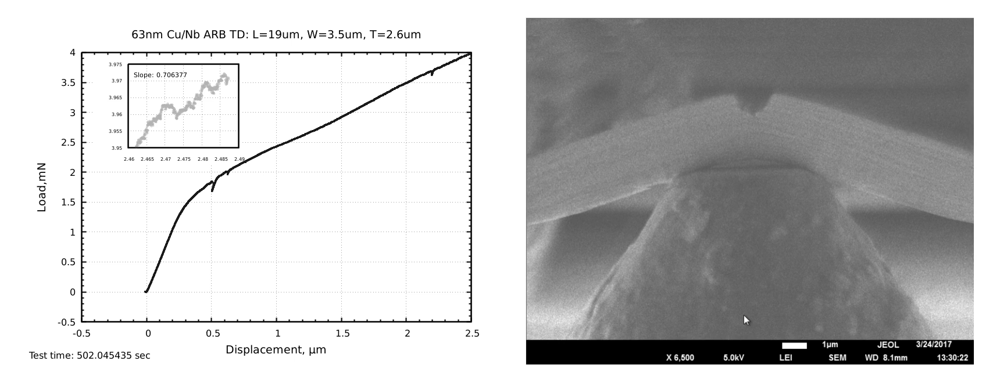

# video-graph

The script works with load/displacement/time data from Hysitron PI, which is exported to a txt file. The load/displacement is plotted and combined with the video recording.



## Requirements

1. gnuplot
2. ffmpeg
3. bash

## Installation notes

The gnuplot script should be located in ~/bin/ folder.

## Usage

````
video-graph.sh [-h|--help] [-t|--title <"string">] [-s|--step <number>] [-l|--load <"path">] 
               [-v|--video <"path">] [--verbose] [--merge] [--skip_plot] [--force] input_file

	-h|--help: Show help

	-t|--title: Set plot title. Default: input_file

	-s|--step: Set number of plot points added per video frame. Default: 100

	--delay: Relative delay of the load-displacement data to video, in seconds. Default: 0

	-l|--load: Set gnuplot file to preload 

	-v|--video: Set video file name. Default: input_file_name.mp4

	--script: Path to the gnuplot script. Default: ~/bin/video-graph.gnuplot
    
	--verbose: Show the last generated plot

	--debug: Show debug info

	--merge: Only merge videos. Do not generate images

	--skip_plot: Skip plot generation

	--force: overwrite video files without asking

	--nomini: do not plot mini graph

	--noreddot: do not plot red dot at the last point of the graph

	input_file: plain text data file, first two columns will be plotted, 
              third column is used as a time to align with video
````
